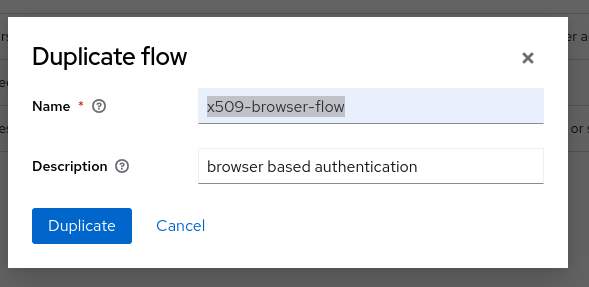
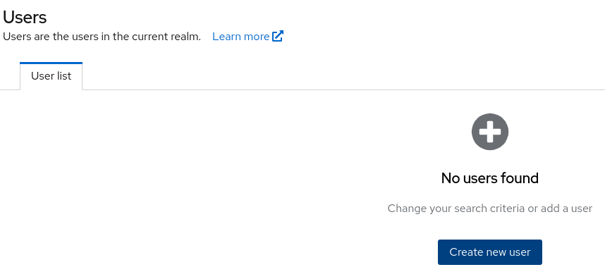

# Configurinng X.509 user1 Certificate Based User Authentication in Red Hat Build of Keycloak with a Customer Trust Heirarchy [RHBK]

> [!NOTE]
> If you found this repo helpful or you found a bug, please feel free to submit a PR, drop me an email kfrankli@redhat.com, or even just star the repo. I welcome any and all feedback. 

## Overview

This repository outlines the steps needed to configure X.509 certificate based user authentication. It includes not only the steps needed to configure RHBK (Red Hat build of Keycloak), but also how to create a simple certificate trust heirarchy to test this.

Note this is made available for demonstration purposes and is not representative of a production ready configuration. Further steps would be required.

## Instructions

### Creating our X509 Heirarchy

1.  Make directories we will need:

    ```console
    mkdir -p rhbk-testing/CA
    ```

2.  Change directories:

    ```console
    cd rhbk-testing/CA
    ```

3.  We're going to have to create a X509 certificate trust heirarchy in order to properly test this out. We'll first create a root-CA and 2 end-entity certificates for the user1 and server that we will use to test. Since we're creating a new root-CA, we will also have to configure the trust heirarchy.

    

4.  Generate the private key and pem encoded certificate for the root-CA:

    ```console
    openssl ecparam -out CA.consulting.redhat.com.key -name secp384r1 -genkey

    openssl req -x509 -new -key CA.consulting.redhat.com.key -out CA.consulting.redhat.com.crt -outform pem -sha384 -subj "/C=US/ST=VA/L=TYSONS/O=RED HAT/OU=CONSULTING/CN=CA.consulting.redhat.com"
    ```

5.  Now that we have our CA, we will generate private keys for the server (`rhbksrvr`) and client (`user1`)

    ```console
    openssl ecparam -out rhbksrvr.consulting.redhat.com.key -name secp384r1 -genkey

    openssl ecparam -out user1.consulting.redhat.com.key -name secp384r1 -genkey
    ```

6.  Create a Certificate Signing Request (CSR) for the newly created server (`rhbksrvr`) and client (`user1`) keys:

    ```console
    openssl req -new -nodes -key rhbksrvr.consulting.redhat.com.key -outform pem -out rhbksrvr.consulting.redhat.com.csr -sha384 -subj "/C=US/ST=VA/L=TYSONS/O=RED HAT/OU=CONSULTING/CN=rhbksrvr.consulting.redhat.com"

    openssl req -new -nodes -key user1.consulting.redhat.com.key -outform pem -out user1.consulting.redhat.com.csr -sha384 -subj "/C=US/ST=VA/L=TYSONS/O=RED HAT/OU=CONSULTING/CN=user1.consulting.redhat.com"
    ```

7.  Use the root-CA you created in step 4 to sign the server and user1 CSRs:

    ```console
    openssl x509 -req -in rhbksrvr.consulting.redhat.com.csr -CA CA.consulting.redhat.com.crt -CAkey CA.consulting.redhat.com.key -CAcreateserial -out rhbksrvr.consulting.redhat.com.crt -days 2048 -sha384

    openssl x509 -req -in user1.consulting.redhat.com.csr -CA CA.consulting.redhat.com.crt -CAkey CA.consulting.redhat.com.key -CAcreateserial -out user1.consulting.redhat.com.crt -days 2048 -sha384
    ```

8.  Convert the pem format certicate to PKCS12 format:

    ```console
    openssl pkcs12 -export -out rhbksrvr.consulting.redhat.com.p12 -inkey rhbksrvr.consulting.redhat.com.key -in rhbksrvr.consulting.redhat.com.crt -certfile CA.consulting.redhat.com.crt -password pass:JBossRocks#123 -name "rhbksrvr.consulting.redhat.com"

    openssl pkcs12 -export -out user1.consulting.redhat.com.p12 -inkey user1.consulting.redhat.com.key -in user1.consulting.redhat.com.crt -certfile CA.consulting.redhat.com.crt -password pass:JBossRocks#123 -name "user1.consulting.redhat.com"
    ```

9.  Now convert the PKCS12 format files to Java Keystore (JKS) format:

    ```console
    keytool -importkeystore -destkeystore rhbksrvr.consulting.redhat.com.jks -srckeystore rhbksrvr.consulting.redhat.com.p12 -srcstoretype PKCS12 -srcalias "rhbksrvr.consulting.redhat.com" -destalias "rhbksrvr.consulting.redhat.com" -srcstorepass JBossRocks#123 -deststorepass JBossRocks#123

    keytool -importkeystore -destkeystore user1.consulting.redhat.com.jks -srckeystore user1.consulting.redhat.com.p12 -srcstoretype PKCS12 -srcalias "user1.consulting.redhat.com" -destalias "user1.consulting.redhat.com" -srcstorepass JBossRocks#123 -deststorepass JBossRocks#123
    ```

10. Let's add our root CA to a trusted CAs file:

    ```console
    cat CA.consulting.redhat.com.crt >> CA.crt
    ```

11. Convert that trusted CAs fiile to a java keystore truststore:

    ```console
    keytool -import -alias "CA.consulting.redhat.com" -file CA.consulting.redhat.com.crt -keystore trusts.jks -storepass JBossRocks#123 -noprompt
    ```

### Installing and configuring RHBK

1.  Download `Red Hat build of Keycloak 24.0.6 Server`: [Red Hat build of Keycloak Download](https://access.redhat.com/jbossnetwork/restricted/listSoftware.html?product=rhbk&downloadType=distributions)

    

2.  Switch up a directory so that you're in `./rhbk-testing`

    ```console
    cd ..
    ```

3.  Copy the downloaded RHBK to the `./rhbk-testing` directory

    ```console
    cp ~/Downloads/rhbk-24.0.6.zip .
    ```

4.  Unzip RHBK:

    ```console
    unzip rhbk-24.0.6.zip
    ```

5.  Change directories into the new rhbk directory:

    ```console
    cd ./rhbk-24.0.6
    ```

6.  Copy the previously created truststore (`trusts.jks`) and the server's PEM encoded certificate/key pair (`rhbksrvr.consulting.redhat.com.crt` & `rhbksrvr.consulting.redhat.com.key`) into the current directory:

    ```console
    cp ../CA/trusts.jks .
    cp ../CA/rhbksrvr.consulting.redhat.com.crt .
    cp ../CA/rhbksrvr.consulting.redhat.com.key .
    ```

7.  Add the PKCS12 certificate/key pair file `rhbk-testing/CA/user1.consulting.redhat.com.p12` to your browser with password `JBossRocks#123`

    

8.  We'll now start rhbk. We will need to pass in the following arguments though:

    | Argument                          | Value                                     | Purpose |
    | --------------------------------- | ----------------------------------------- |---------|
    | `--hostname`                      | `0.0.0.0`                                 | Allowing us to explicitly set the hostname RHBK will listen on |
    | `--https-certificate-file`        | `./rhbksrvr.consulting.redhat.com.crt`    | The location of the public key certificate that RHBK will present to clients connecting |
    | `--https-certificate-key-file`    | `./rhbksrvr.consulting.redhat.com.key `   | The location of the private key that RHBK will present to clients connecting |
    | `--https-trust-store-file`        | `./trusts.jks `                           | The location of the truststore to be used for validating connecting clientts in the case of mutual TLS|
    | `--https-trust-store-password`    | `JBossRocks#123 `                         | The password for the https-trust-store-file |
    | `--https-trust-store-type`        | `jks`                                     | The format of https-trust-store-file |
    | `--https-client-auth`             | `request`                                 | By setting request, RHBK will request client certificates as part of a mTLS connection. It will still succeed without a client certificate when set to `request`. To mandate client certificates set this to `required` |

    ```console
    ./bin/kc.sh start --https-certificate-file=./rhbksrvr.consulting.redhat.com.crt --https-certificate-key-file=./rhbksrvr.consulting.redhat.com.key --https-trust-store-file=./trusts.jks --https-trust-store-password=JBossRocks#123 --https-trust-store-type=jks --hostname=0.0.0.0 --hostname-debug=true --https-client-auth=request --verbose
    ```

9.  Once RHBK is up and running, open https://0.0.0.0:8443 in the browser of your choice. You've not setup your browser to trust this CA, so simply select proceed anyways:

    

10. Examine the certificate in your browser and confirm it's the one we supplied on the command line:

    

11. Create an administrative user of your choice. In my case I used `admin` and click `Create user`:

    

12. It should confirm the user was created. Now click `Open Administration Console`:

    

13. Now supply your newly created admin credentials and click `Sign In`:

    


14. Now from the dropdown menu on the topright, click `Create realm`:

    

15. Name the new realm `x509-test`, click `Create`:

    


16. Go to Authentication on the left hand side menu:

    

17. Select the `brower` and in the vertical menu, select `Duplicate`:

    

18. Name it `x509-browser-flow` and click `Duplicate`:

    

19. To the newly created `x509-browser-flow ` click `Add step`:

    

20. Add a `X509/Validate Username Form` step and click `Add`

    

21. Shift `X509/Validate Username Form` step to below `Identity Provider Redirector` and set the Requirement field to `Alternative`

    

22. Click the gear icon next to the `X509/Validate Username Form` step:

    

23. In the config popup set `Alias` to `x509-step`. Alter the `A regular expression to extract user idenity` field to `CN=(.*?)(?:,|$)`. Set the `User mapping method` to `Username or Email` and clear out the `A name of user attribute` field. Lastly click `Save`. This will examine the certificate presented by the client and will lookup a user based on the commonname, CN, field of the certificate:

    

24. Now click the `Action` menu in the top right and select `Bind Flow`:

    

25. Choose `Browser flow` and click `Save`:

    

24. Go to Users:

    

25. Click `Create new user`

    

26. Set the `Username` to the CN we created for our client user, in this case `user1.consulting.redhat.com` and click `Create`:

    

27. Now in a new private window in the brower you added the client certificate to, navigate to https://0.0.0.0:8443/realms/x509-test/account/#/. It should now prompt you for the client certificate, which you should elect to provide:

    

28. RHBK should now ask if you want to continue to login via certificate as that user. Click `Continue`

     

29. It will now ask you to supply some basic user information for the account. Please supply it and click `Submit`:

     

30. You should now be successfully logged in as `user1.consulting.redhat.com` to the `x509-test` realm of RHBK!

    

## Resources

*   [Red Hat Solutions: How to configure X.509 client certificate based user authentication in RHBK Operator ?](https://access.redhat.com/solutions/7057715)
*   [Red Hat build of Keycloak Documentation: Confguring X.509 Client Certificate Authentication](https://docs.redhat.com/en/documentation/red_hat_build_of_keycloak/22.0/html/server_administration_guide/configuring-authentication_server_administration_guide#creating_a_password_less_browser_login_flow)